**Trang login/register:**
Hỗ trợ đăng kí, đăng nhập qua email, google, cập nhật mật khẩu qua email 

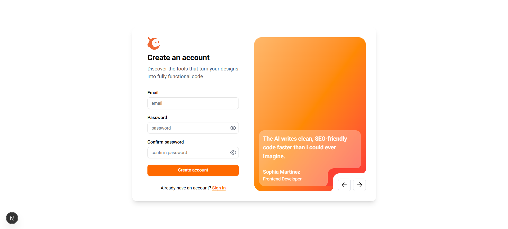

**Trang chat:**
Hỗ trợ hiển thị hội thoại, mã nguồn, nội dung trả lời có định dạng markdown, và lưu lại lịch sử cuộc trò chuyện để người dùng dễ dàng truy xuất.
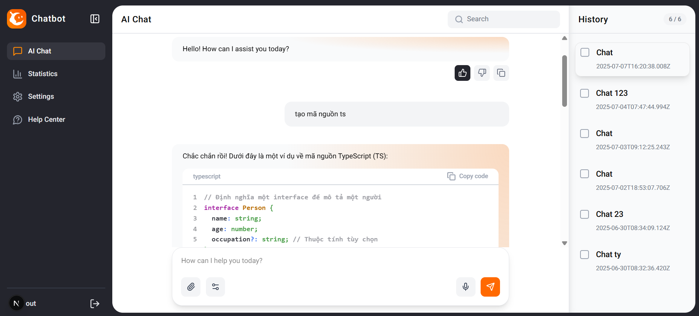

**Trang thống kê điểm:**  Hiển thị số điểm hiện có và lịch sử sử dụng điểm để trò chuyện với chatbot. Điểm được reset lúc 0h hằng ngày
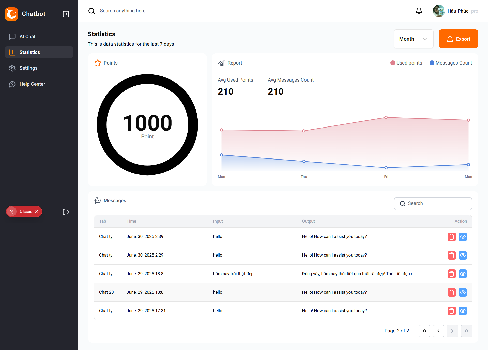

**Trang cài đặt profile:**  
Người dùng thay đổi các thông tin cá nhân và cập nhật mật khẩu
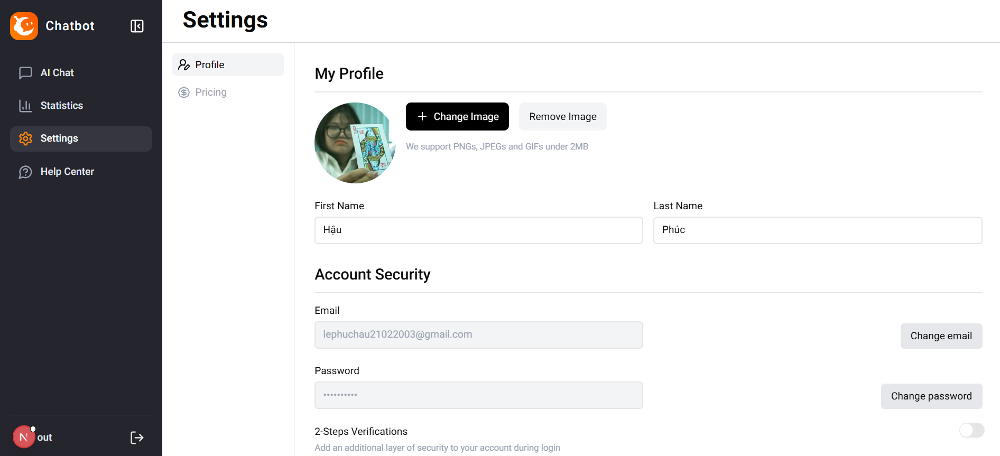

**Trang nâng cấp tài khoản:**
Nâng cấp tài khoản pro cho phép user có nhiều điểm hơn trong ngày và có nhiều tính năng hơn
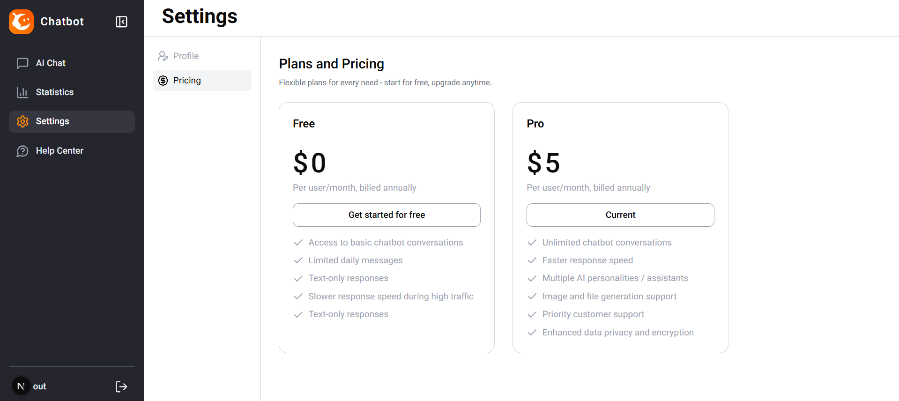
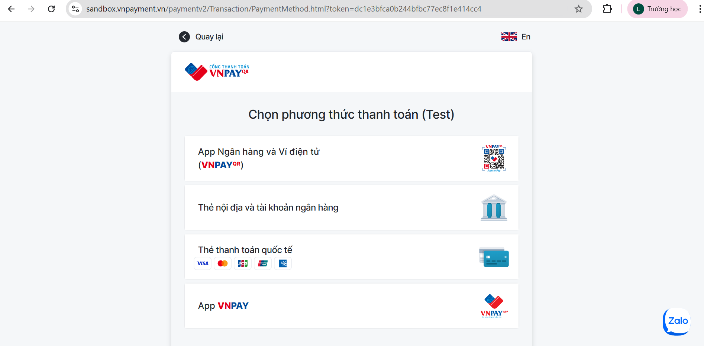

**Trang hỗ trợ khách hàng:**
Người dùng có thể đăng các câu hỏi để admin hoặc người dùng khác trả lời. Admin có thể đính các bài đăng hữu ích giải đáp thắc mắc của người dùng
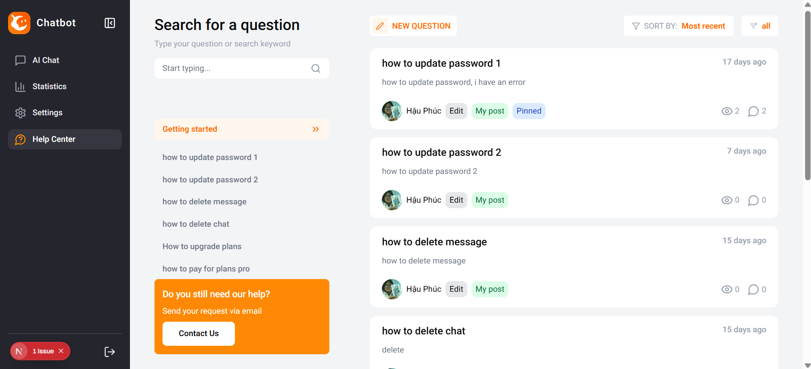
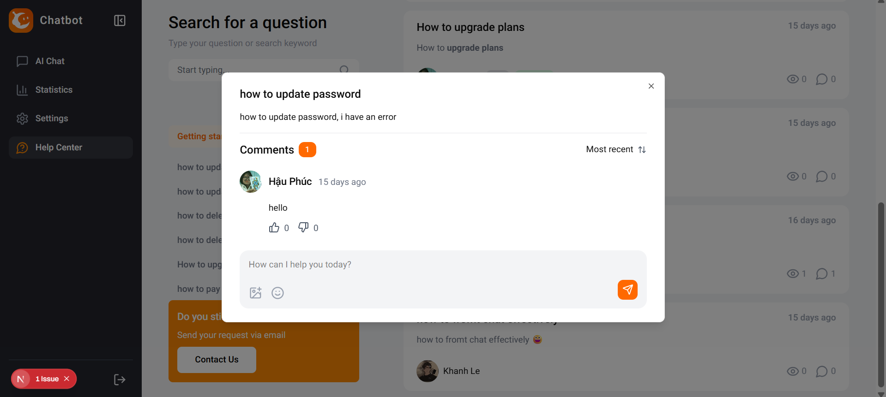
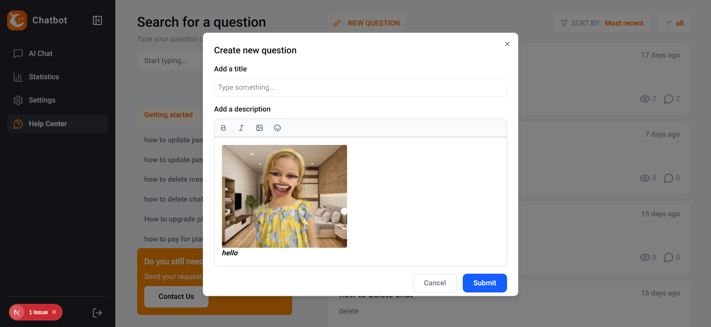

**Trang admin dashboard:**
Thống kê doanh thu từ các user nâng cấp tài khoản, thống kê theo từng năm
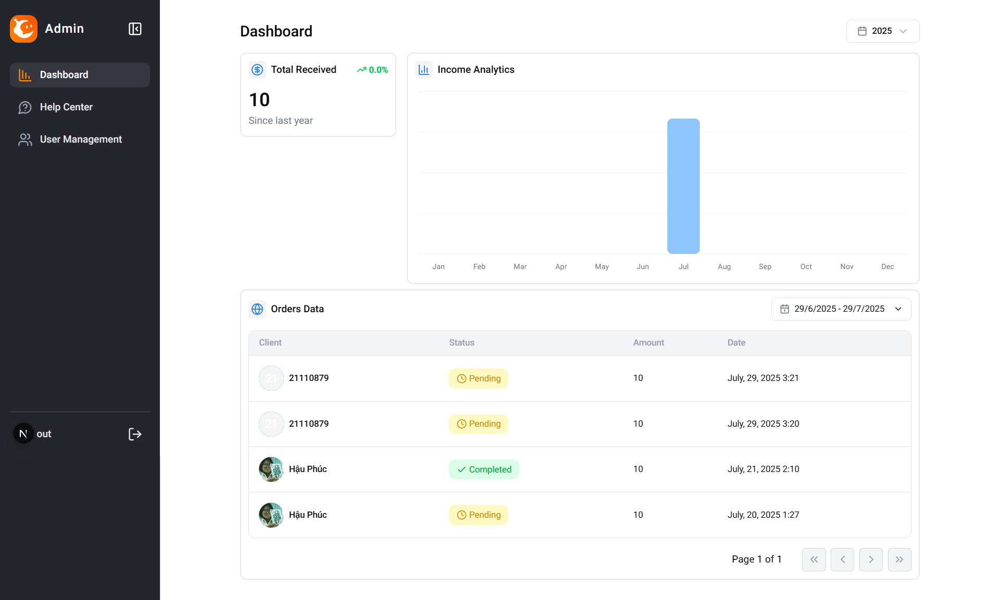

**Trang admin quản lí người dùng:**
Quản lí người dùng, cho phép khóa tài khoản, xem thông tin người dùng, xem lịch sử giao dịch của người dùng
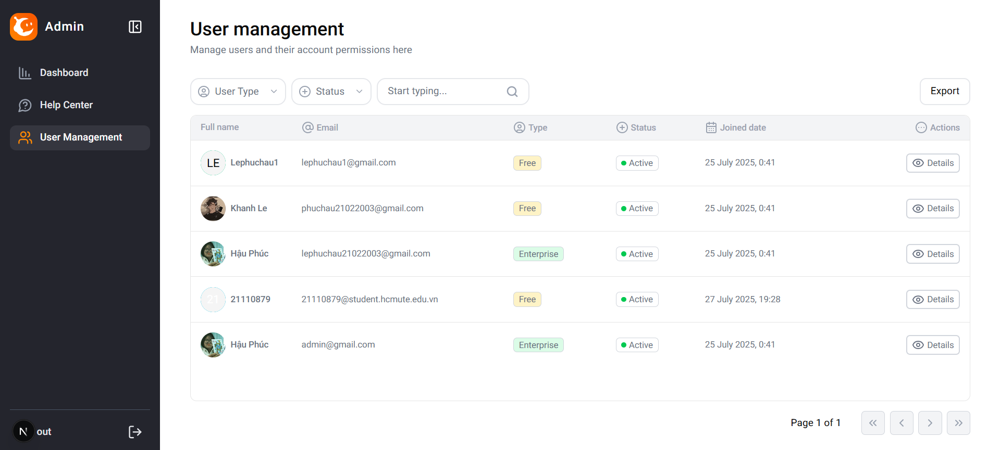
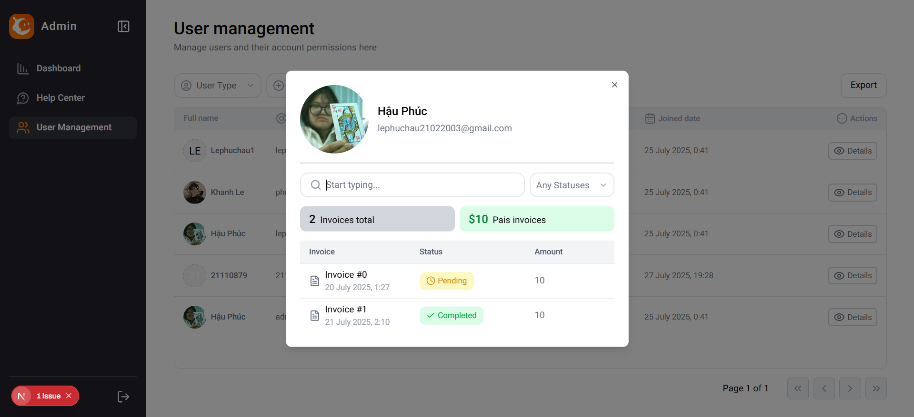
